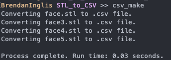

# STL to CSV
This program converts mesh files in an .stl format to a comma-separated values list of xyz coordinates. In conjunction with a custom [3D CSV Onshape code](https://forum.onshape.com/discussion/12921/importing-data-points-from-a-csv-file), this allows for importing .stl files to OnShape.

## Python Code
Raw .stl files have the following format - the vertices of each face (the three points of each triangle) are separated into "loops":
```
solid face
facet normal 0 0 0
	outer loop
		vertex -0.0393849 0.023303038 0.03564223
		vertex -0.039511416 0.02082098 0.034457665
		vertex -0.03597968 0.020643527 0.036249146
	endloop
facet normal 0 0 0
	outer loop
		vertex -0.036101937 0.022603136 0.037045743
		vertex -0.0393849 0.023303038 0.03564223
		vertex -0.03597968 0.020643527 0.036249146
	endloop
  
  ...
```
The Python code I wrote finds all lines starting with 'vertex' and scrapes the XYZ coordinats from each line. The points are then written in comma-separated-values format to a file.

```python
if line.strip().startswith("vertex"):
    s_line = line.split(" ")
    s_line = s_line[1:]
    csv_lines = ",".join(s_line)
    f.write(csv_lines)
...
```

I wanted to convert multiple .stl files to multiple .csv files at once, so I used some bash shortcuts to turn the Python script into a function.

```
# CSV from STL
alias csv_make="cd ~/Documents/STL_to_CSV && python3 STL_Cloud.py"
```

The Python script will now look for .stl files within the working directory of the Py script.
```python
# Open STL Data
for x in os.listdir():
    if x.endswith(".stl"):
        # Prints only text file present in My Folder
        print("Converting " + x + " to .csv file.")
...
```
Running ```csv_make``` will find all .stl files within the specified directory and convert them into .csv files! Example output from above:
```
-0.0393849,0.023303038,0.03564223
-0.039511416,0.02082098,0.034457665
-0.03597968,0.020643527,0.036249146
-0.036101937,0.022603136,0.037045743
-0.0393849,0.023303038,0.03564223
-0.03597968,0.020643527,0.036249146
```
The six points are now in .csv format. 

Command line output:




